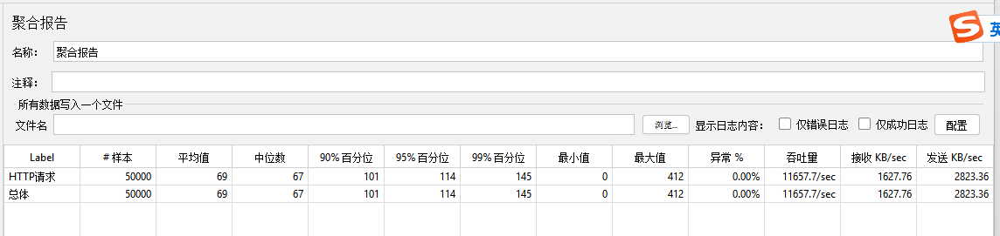

## 场景

### 问题1：

单机，业务高峰 qps 1000，增删改查频次可自行设定，场景可自行设定，需要在思路中描述场景?

* 解：暂定为锁库场景，多个订单进行库存扣减，其中主要的难点在于高并发扣减，并且不允许出现超卖问题。
* 考虑到使用本地内存，所以基准TPS设定为10000，题目并未考虑到数据量，那么可以先从10个量为基准进行相关的测试

> tips：扩展，如果使用持久化，想要获得非常大的TPS怎么处理？

### 问题2：

采用内存存储，并设计持久化以及恢复功能，持久化要求尽可能实时，成本尽可能低，不成为性能瓶颈，崩溃后需要快速恢复，并且数据无误

* 解：暂定数据库mysql、pgsql，处于性能和成本，采用数据库异步写入，不干扰主线程的库存扣减。写入采用追加逻辑日志的形式，然后由异步线程写入到数据库中。

### 内存数据结构选型

记录Id，名称，创建人，首先数据存储可以采用map的形式，这样数据根据记录Id查询就是O(1)的复杂度，名称这里暂时称为sku，那么sku名称也是不可以重复的，所以可以使用map作为辅助索引，那么创建人和创建时间因为其重复的特性，需要使用一种有序的，支持范围顺序选取的，暂定为treeMap，底层为红黑树，支持有序，并且增删改查时间复杂度都为O(logN)，比较平均。

* 所以最终的结果：主数据采用普通hashmap，主要是为了O(1)的查询，然后采用一个名称的二级辅助hashmap索引，再加上创建人和创建时间的treeMap作为存储的两个有序索引。

#### 结论

业务场景选择为锁库场景，高并发下多个订单对相同sku库存进行扣减进行测试性能。内存存储使用一个主数据hashMap，持久化使用文件json形式，真实场景可以选用数据库，这里只是为了不想多引入中间件，一切都以内存代码实现，不引入额外的组件。

#### 功能测试及性能迭代：

##### 1. 最初版本

> 此版本是最初版本，不做锁库的并发控制，持久化未异步分离，对功能做详细测试及相关性能测试，测试工具选为jmeter，内存：2G CPU：8核

###### 测试结果：

​	以上为测试数据和测试线程，当前测试对洋葱Tr进行并发50000次库存扣减，发生了并发问题，1000个线程每个线程执行50次，扣减完成之后发现库存还剩182，然后查看扣减日志发现内存数据有明显的并发问题，超卖问题也存在。性能为8000TPS左右，因为持久化是同步，并且是同步写入一个文件，所以拖慢了整体性能。

##### 2. 迭代版本

> 第二个版本，主要针对并发做控制，不发生超卖问题，异步持久化提高性能

###### 测试结果：

以上为测试数据和测试线程，当前测试对洋葱Tr进行并发1千次库存扣减，未发生并发问题，主要是针对锁库存方法添加了排他锁，对**deductionStock**和**increaseStock**方法都增加了排他锁，并且分离持久化的机制，持久化机制选用了内存队列，然后由异步线程去按照顺序消费队列的中的数据。优化后并发问题已解决，吞吐量来到了11000TPS附近。

* **持久化选型问题及解决方案**：
    * 1. **持久化选型为文本存储json**的形式拖慢了性能，由于每次修改和添加都需要读取整个文本进行处理导致性能较慢，并且由于文件读取，还必须进行同步锁控制，所以非常的慢。只是为了本次demo不引入其他中间件的无奈之选，
    * 2. 正式环境可以换数据库形式，例如mysql等，这样在修改数据时可以针对单一数据增加行锁，不用做整体的并发控制，并且修改和添加也不需要获取所有数据
    3. **分离方式选择内存队列**：选用内存队列可以使数据有序，并且分离生产者和消费者。但是由于内存队列的特性所以当系统临时宕机时可能出现数据丢失的问题。可以选用第三方消息队列如kafka等。
    4. 如果不引入三方组件，也可以使用文本追加逻辑日志的形式。例如使用本文追加逻辑日志，然后使用记录起始游标，批量将逻辑日志变为数据进行持久化。注意这里追加逻辑日志应该与扣减库存作为一个原子性进行处理，追加逻辑日志成功才算一次事务成功，我这里使用放入队列成功就算成功。
    5. **超卖问题**： 由于整个扣减库存的方法都加了排他锁，所以超卖问题也得到了解决

##### 3. 迭代版本2

> 迭代版本1的已经能够大致解决并发问题和性能问题，性能已经达到题目要求的1000，但是还有很多优化方案

**优化方案：**

 	1. 锁的粒度细化，现在的锁针对于整个锁库存方法，这显然是不对的，如果数据上千万条，那么当一个线程持有对象锁时，其他线程都需要等待，但其实其他线程并不与持有锁的线程有冲突，因为两个线程想要扣减的库存数据不一样，所以可以将锁的粒度缩小，最小到sku级别。这样在实际业务场景中才能最大化性能。
 	2. 锁的范围缩小，此范围指的是将锁的业务范围缩小，例如可以再读取库存阶段使用读锁，在真正扣减库存时再使用排他锁，进行锁的升级，这样可以最小化锁的范围
 	3. **读锁+乐观锁->排他锁** 可以先使用读锁，然后使用乐观锁进行比较锁库存，如果失败，添加排他锁进行处理

**以上是我对本次题目的一些思考和demo实现，由于内存性能已经非常好了，所以没有进行迭代版本3的优化，整个demo确保了锁库存和添加库存的线程安全，还有超卖问题处理**
#### 使用截图：
